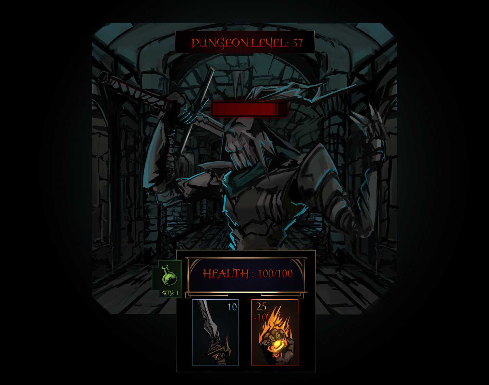

# EnterTheAbyss
Project Zero
## Homenu

## Battle

Source: Me. Jack Phan

## MVP Pitch
Are you prepared to enter the deepest Abyss? For gold and glory, you will enter into the most challenging dungeon. You can kill your enemy by using either magic or physical weapon, but watch out, the magic spell can harm you but deliver the most powerful blow to your enemy. The user will have 3 potions to start with. Plan your moves carefully, the enemies keep getting stronger as you enter deeper into the abyss.

## User Stories:
## Start
- The user can either click on the "Game Start" to start the game or click on "How To Play" 
- After the user clicks the "Game Start" button, the user will begin with 100 health. The user has no sprite, but the enemy will have one. 
- The user can check the status information at bottom along with attack buttons.

## Gameplay:
- The battle will play in turns. The turn starts with the player. After each battle, a prompt will allow user to either continue or retreat. 
- The enemy will have base Health 10 and attack 5 (subject will change). Every time the player successfully defeat the monster, the monster will increase their health pool by 5 after the level. The game ends when player's health is down to 0.
- The player will have 3 tools at their disposal:
    1. Physical attack(sword icon): The attack has 10 damage
    2. Magic attack (fire ball icon): This attack deals 25 damage but at the cost of 5 health deducted from the player's side. 
    3. Health potion: The player starts with 3 potions at the start, this item will allow the player to heal 10 Health Points each use.

## End:
- The Game will be over either by having the user retreat or player's health point reduces to 10. 

## Stretch Goals: 
- More intuive UI with chat log that tells the user and ememy's action history
- Enemy name and Health bar displayed on enemy's head.
- Health potions get resupplied every 3 or 5 battles.
- Boss battle after 5 rounds.
- User Name can be displayed on UI.
